显示 / 隐藏动画

<picture>
  <source media="(prefers-reduced-motion: reduce) and (prefers-color-scheme: dark)" srcset="assets/pixel-space-dark-static.svg">
  <source media="(prefers-reduced-motion: reduce)" srcset="assets/pixel-space-light-static.svg">
  <source media="(prefers-color-scheme: dark)" srcset="assets/pixel-space-dark.svg">
  
</picture>

